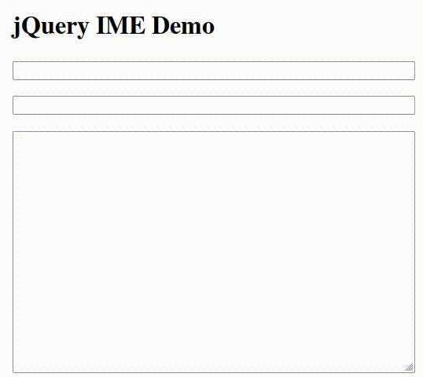

jQuery.IME
==========

jQuery.IME is a jQuery based input method editor library supporting more than
220 input methods across more than 120 languages.



These input methods are well tested. Initially the input methods were
contributed by the Wikimedia community. By now many input methods have also
been contributed by Red Hat.

This project is a Wikimedia foundation initiative to provide language technology
tools to a wider audience outside the Wikimedia universe.

This input tool is widely deployed in all Wikimedia projects (eg: wikipedia).


Quick start
-----------

```bash
git clone https://github.com/wikimedia/jquery.ime.git
```

Load the necessary scripts:
```html
<link href="../css/jquery.ime.css" rel="stylesheet" />
<script src="//ajax.googleapis.com/ajax/libs/jquery/1.10.1/jquery.min.js" ></script>
<script src="../src/jquery.ime.js"></script>
<script src="../src/jquery.ime.selector.js"></script>
<script src="../src/jquery.ime.preferences.js"></script>
<script src="../src/jquery.ime.inputmethods.js"></script>
```

To add input method support to all editable elements:

```javascript
$( 'textarea, [contenteditable], input[type=text], input[type=search], input:not([type])' ).ime();
```

jquery.ime provides a jquery plugin function `$.fn.ime()` to add input method
support for any editable elements in a page.

Language selection API
----------------------

Instead of using the default language selector, you can roll your own:

```javascript
$myDiv= $( '.foo' );
$myDiv.ime( { showSelector: false } );
ime = $myDiv.data( 'ime' );
$elements.on( 'imeLanguageChange', function () { ... } );
$elements.on( 'imeMethodChange', function () { ... } );

currentLanguageCode = ime.getLanguage();
currentLanguageName = ime.getAutonym( currentLanguageCode );
allLanguageCodes = ime.getLanguageCodes();
inputMethods = ime.getInputMethods( currentLanguageCode );
ime.setIM( inputMethods[ 0 ].id );
```

See examples/ced/ced.html for a more complete example.

Running
-------

-If you have python installed, run
-```bash
 python3 -m http.server
-```

Alternatively, many programming languages provide one liner commands to start a
simple http static servers. You can use [any one of them](https://gist.github.com/willurd/5720255)
and, you can access examples from

```bash
http://localhost:8000/examples/index.html
```

Alternatively you can use tools like webfsd. If you know how to use advanced
web servers like Apache or Nginx, you already know how to put the code in a
webserver.

Plugin Options
--------------

| Option  | Description |
|---------|---------------------|
| imePath | Relative/Absolute path for the rules folder of jquery.ime. Default value: '../' |
| languages| Languages to be used- by default all languages. Default value:  []. Eg: ['hi', 'ml']. It can also be a function returning an array.|
| helpHandler| Called for each ime option in the menu, default value: null|
| showSelector | Whether the input method selector to be used or not. Default value is true |

Browser extensions
------------------
This input tool is also available as a browser extension:
* [Firefox Extension](https://addons.mozilla.org/en-US/firefox/addon/wikimedia-input-tools/) | [source code](https://gitlab.com/kskarthik/wikimedia-input-tools)
* [Chrome extension](https://chrome.google.com/webstore/detail/wikimedia-input-tools/fjnfifedbeeeibikgpggddmfbaeccaoh) | (Unmaintained)  | [source code](https://github.com/pravee-n/jquery.ime-chrome-extension)

For Developers
--------------

Read [rules/README.md](https://github.com/wikimedia/jquery.ime/tree/master/rules)
to learn how to write an input method for a language.

Read [test/README.md](https://github.com/wikimedia/jquery.ime/tree/master/test)
to learn how to write and run tests for an input method.

Read the technical specification of the project from
[wiki](https://github.com/wikimedia/jquery.ime/wiki/Technical-Specification).

Do watch the code walkthrough by Chris Forno: http://www.youtube.com/watch?v=LPec-KIBVeI

License
-------
This project is dual licensed with GPLv2+ and MIT license. See the license
files in the source code for more details.
